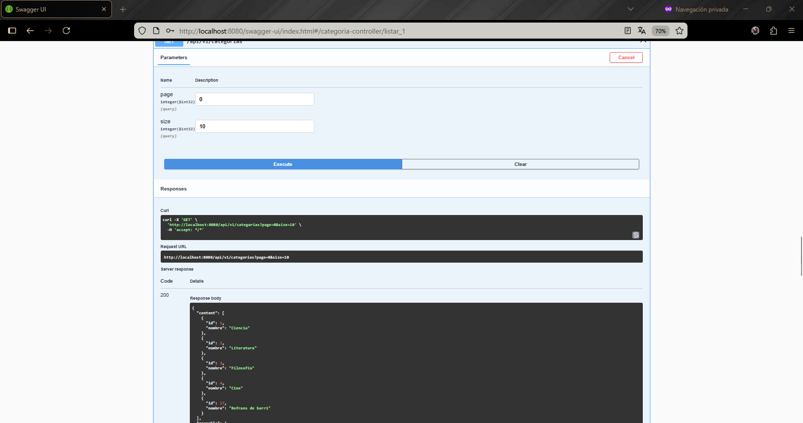
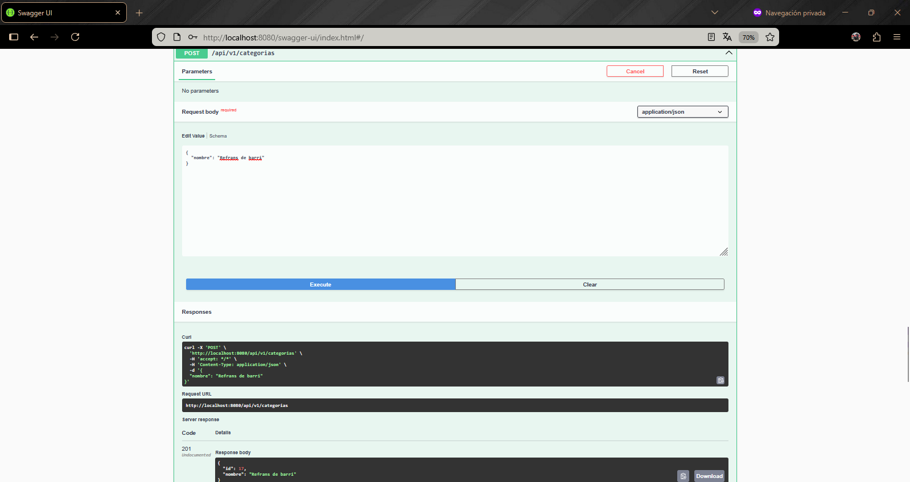
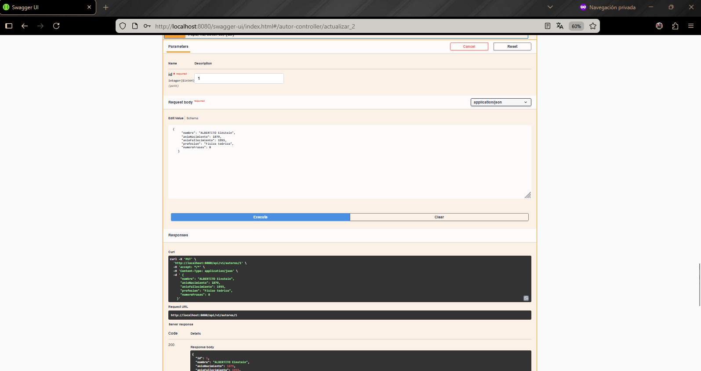
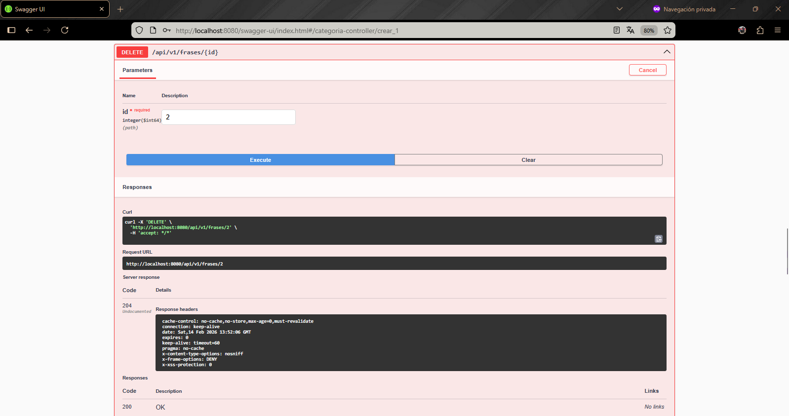

# Proyecto API Frases Célebres

Para este ejercicio final se ha creado una API REST que gestiona frases célebres de autores de toda la historia y también algunas de cine, pudiendo ser el punto de partida para un proyecto de app con esta misma temática.

Se ha hecho con **Spring Boot** y se ha utilizado una base de datos **PostgreSQL** en Docker y las pruebas y consultas con **Swagger**.

## Stack Tecnológico

- **Java 21**
- **Spring Boot 3.x**
- **Gradle**
- **PostgreSQL**
- **Docker & Docker Compose**
- **Swagger / OpenAPI**

## Capas del proyecto

El proyecto está correctamente dividido y con las dependencias abstraídas para que sea fácil de mantener y escalar.

- **Controladores**: La puerta de entrada de los datos que reciben las peticiones HTTP.
- **Servicios**: Gestionan y controlan los datos y la lógica de negocio.
- **Repositorios**: Hacen de intermediario entre la lógica de negocio y la base de datos.
- **Modelos**: Representan las entidades de la base de datos.
- **DTO**: Plantillas para transferir datos entre capas.
- **Excepciones**: Captura y gestiona todos los errores globales.

## Roles y Seguridad

- **Admin**: Control total (POST/PUT/DELETE).
- **User**: Solo lectura (GET).

## Endpoints principales

- `/api/v1/frases` (Frases y frase del día).
- `/api/v1/autores` (Gestión de autores).
- `/api/v1/categorias` (Clasificación).

## Capturas de peticiones

### GET



### POST



### PUT



### DELETE



## Puesta en marcha

_En resources tenemos data.sql que carga los datos iniciales de la base de datos._

1. Levantar Docker:

   ```bash
   docker compose up -d
   ```

2. Iniciar la aplicación:
   - Ejecutar `ApiFrasesApplication` desde tu IDE.
   - O por terminal: `./gradlew bootRun`

3. Acceder a Swagger:
   - <http://localhost:8080/swagger-ui.html>

4. **Credenciales**:
   - Usuario: `user` / `admin`
   - Contraseña: `1234`
